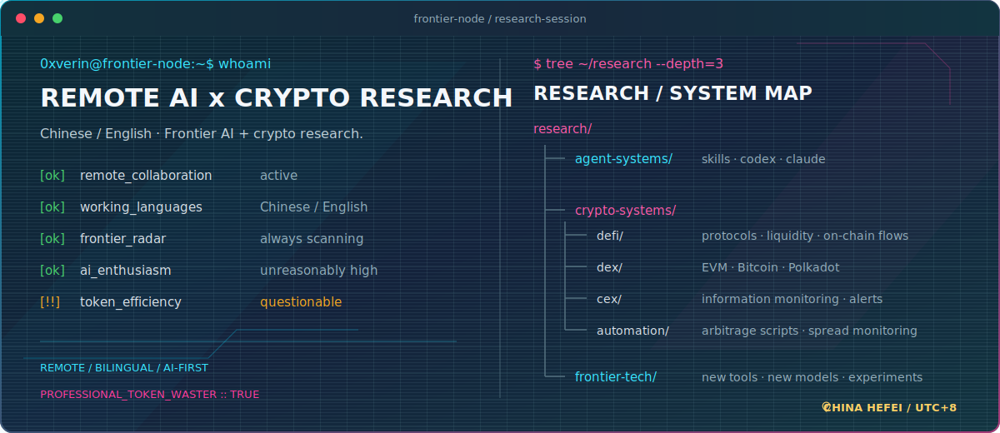

  

---

### `$ connect --channels`

### `$ tail -n 2 ~/recent-posts.log`

<!-- BLOG-POST-LIST:START -->
- `[POST_01]` [一个Web3开发的入门历程](https://juejin.cn/post/7138072108516507661)
- `[POST_02]` [Web3远程开发的年终总结](https://juejin.cn/post/7187272999546912828)
<!-- BLOG-POST-LIST:END -->
